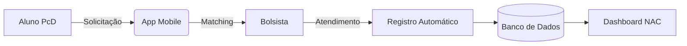

## ✨ Visão geral

O projeto nasce para resolver um problema estrutural: o MobiUFAL opera hoje sem suporte tecnológico dedicado, dependendo de WhatsApp e registros manuais — o que limita sua eficiência, escalabilidade e capacidade de gestão.

O Mobiliza transforma esse cenário ao introduzir um ecossistema completo composto por:

* 📱 Aplicação mobile (alunos e bolsistas)
* 📊 Dashboard web (gestão do NAC)
* 🧠 Camada de dados estruturados e rastreáveis

---

## 🧩 Problema

O modelo atual apresenta limitações críticas:

| Área              | Problema                                                    |
| ----------------- | ----------------------------------------------------------- |
| Fluxo             | Solicitações e atendimentos feitos manualmente via WhatsApp |
| Privacidade       | Pedidos realizados em grupo público                         |
| Registro          | Preenchimento manual e retroativo em planilhas              |
| Tempo de resposta | Dependente de interação humana não estruturada              |
| Escalabilidade    | Incapacidade de acompanhar o crescimento da demanda         |
| Gestão            | Falta de dados confiáveis para tomada de decisão            |

---

## 🎯 Objetivo

O Mobiliza busca transformar um serviço manual em uma operação estruturada, rastreável e escalável, de modo a:

* Garantir **solicitações privadas e acessíveis**
* Estruturar o fluxo de atendimento
* Automatizar o registro de dados
* Oferecer **visibilidade em tempo real**
* Permitir decisões baseadas em evidências
* Reduzir barreiras sociais e operacionais

### 📊 Impacto esperado

| Dimensão    | Resultado                                    |
| ----------- | -------------------------------------------- |
| Estudantes  | Mais autonomia, privacidade e dignidade      |
| Bolsistas   | Fluxo de trabalho mais eficiente             |
| NAC         | Gestão baseada em dados                      |
| Instituição | Escalabilidade e sustentabilidade do serviço |

---

## 🏗️ Arquitetura da solução

---

## 🚀 Funcionalidades

### 👩‍🦯 Para estudantes

* Solicitação privada de deslocamento
* Interface acessível (visual e motora)
* Suporte a áudio
* Acompanhamento em tempo real
* Rotas frequentes

---

### 🧑‍💼 Para bolsistas

* Recebimento estruturado de solicitações
* Indicação de disponibilidade em tempo real
* Execução guiada do atendimento
* Registro automático

---

### 🧑‍💻 Para gestão (NAC)

* Dashboard operacional em tempo real
* Visualização de bolsistas e atendimentos
* Relatórios automatizados
* Análise de padrões de demanda

---

## ♿ Acessibilidade como princípio

> [!IMPORTANT]
> A acessibilidade não é uma feature — é um requisito central.

O sistema é projetado para:

* Compatibilidade com leitores de tela
* Navegação por teclado
* Feedback por áudio (TTS)
* Interface de alto contraste
* Fluxos simplificados e previsíveis

Além disso, considera práticas reais do serviço, como:

* Uso intensivo de áudio por alunos com deficiência visual
* Necessidade de autonomia progressiva (aprendizado de rotas)
* Comunicação descritiva durante o deslocamento

---

## 🔧 Tecnologias (provisório)

### App mobile

| Tecnologia | Eixo |
| ---------- | ----- |
| React Native + Expo | Desenvolvimento |
| NativeWind + TailwindCSS | Estilização |

### Dashboard web

A definir...

### Backend

A definir...

---

## 🤝 Colaboração

Este é um projeto acadêmico da Universidade Federal de Alagoas (UFAL), desenvolvido em parceria com o NAC e com apoio da PROEST, com foco em impacto social e acessibilidade.

---

## 📄 Licença

A definir
